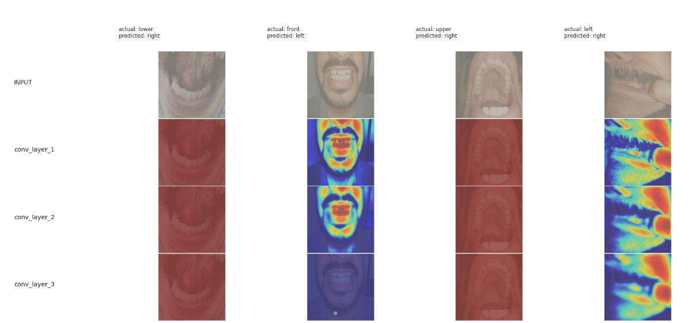

# Jaw Image classification

Done: 

- [x]  Basic skeleton of code
- [x]  Data pipeline
- [x]  Basic Transforms
- [x]  Custom ResNet model
- [x]  Accuracies per class
- [x]  Plotting of metrics
- [x]  Plotting miss-classified
- [x]  Grad CAM analysis

Todo : 

- [ ]  Custom dataset loader than ImageFolder for more control on transforms
- [ ]  Using weighted sampler than random, for class imbalanced training
- [ ]  Training for furthre epochs, more experimentation
- [ ]  Confusion matrix
- [ ]  Conclusions

# Problem Statement: 
Train deep learning model to classifiy jaw images

## Dataset:

Sample of images per class:


## Model:

Custom Resnet model with ~6M params

Model Summary:

```
----------------------------------------------------------------
        Layer (type)               Output Shape         Param #
================================================================
            Conv2d-1         [-1, 64, 256, 256]           1,792
              ReLU-2         [-1, 64, 256, 256]               0
       BatchNorm2d-3         [-1, 64, 256, 256]             128
            Conv2d-4        [-1, 128, 256, 256]          73,856
         MaxPool2d-5        [-1, 128, 128, 128]               0
       BatchNorm2d-6        [-1, 128, 128, 128]             256
              ReLU-7        [-1, 128, 128, 128]               0
            Conv2d-8        [-1, 128, 128, 128]         147,456
       BatchNorm2d-9        [-1, 128, 128, 128]             256
           Conv2d-10        [-1, 128, 128, 128]         147,456
      BatchNorm2d-11        [-1, 128, 128, 128]             256
       BasicBlock-12        [-1, 128, 128, 128]               0
           Conv2d-13        [-1, 256, 128, 128]         295,168
        MaxPool2d-14          [-1, 256, 64, 64]               0
      BatchNorm2d-15          [-1, 256, 64, 64]             512
             ReLU-16          [-1, 256, 64, 64]               0
           Conv2d-17          [-1, 512, 64, 64]       1,180,160
        MaxPool2d-18          [-1, 512, 32, 32]               0
      BatchNorm2d-19          [-1, 512, 32, 32]           1,024
             ReLU-20          [-1, 512, 32, 32]               0
           Conv2d-21          [-1, 512, 32, 32]       2,359,296
      BatchNorm2d-22          [-1, 512, 32, 32]           1,024
           Conv2d-23          [-1, 512, 32, 32]       2,359,296
      BatchNorm2d-24          [-1, 512, 32, 32]           1,024
       BasicBlock-25          [-1, 512, 32, 32]               0
        MaxPool2d-26            [-1, 512, 8, 8]               0
           Linear-27                    [-1, 5]         163,845
================================================================
Total params: 6,732,805
Trainable params: 6,732,805
Non-trainable params: 0
----------------------------------------------------------------
Input size (MB): 0.75
Forward/backward pass size (MB): 392.25
Params size (MB): 25.68
Estimated Total Size (MB): 418.68
----------------------------------------------------------------
```

## Model analysis


- Model performance:
```
Epoch 5:
Train Loss=0.80
Train Accuracy= 90
Average Test loss: 1636.03
Test Accuracy: 1/5 (20%)
```

- Missclassified Images:

 

- Training curves: 

 

- GradCam for missclassified images
 


